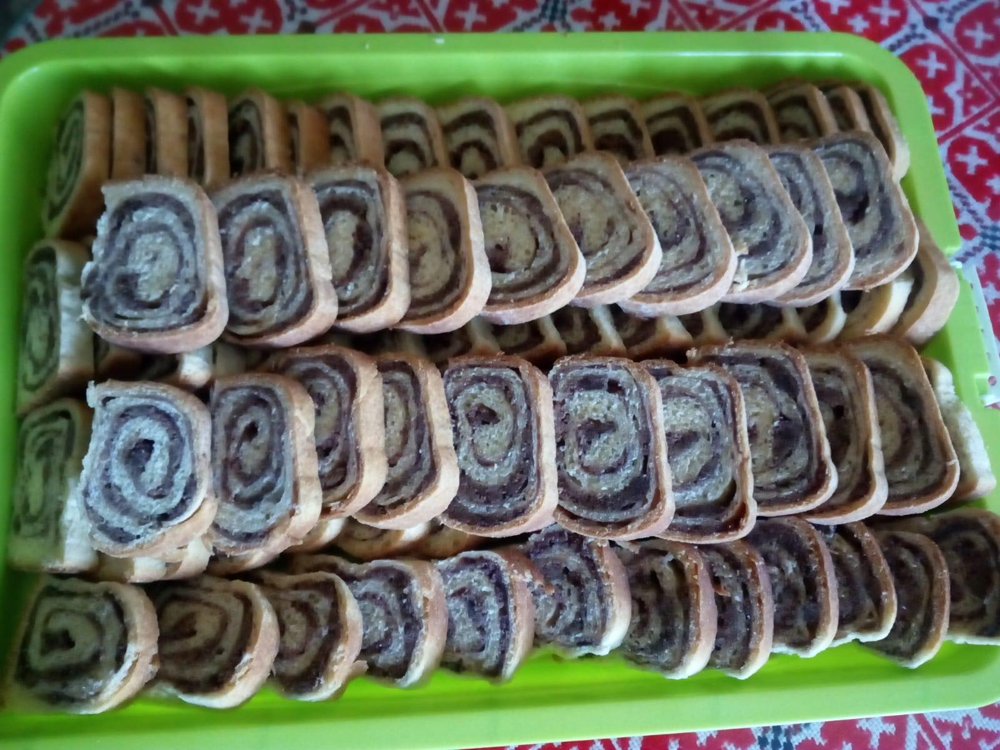

# Orehnjaca

<figure markdown>
  { width="850" .shadow-box}
  <figcaption></figcaption>
</figure>

## Timing and Quantity
| :fork_and_knife_with_plate: Serves | :timer_clock: Total Time |
|:----------------------------------:|:-----------------------: |
| x portions | x minutes |

## :salt: Ingredients
### Dough

- [ ]500g Pšeničnog glatkog brašna
- [ ] 1 germu
- [ ] 100g šećera
- [ ] 2 Vanilin šećera
- [ ] 60 ml   maslaca
- [ ] 2 žumanjka
- [ ] 200 ml mlijeka

### Filling
- [ ] 350 gmljevenih oraha ili maka
- [ ] 50 gšećera
- [ ] 2Vanilin šećera Dolcela
- [ ] snijeg od dva bjelanjka

## :pencil: Instructions

Germu razmutiti u pola deci mljeka i žlicom šećera
Pomiješajte brašno sa germon kada se digne . Dodajte ostatak šećera, vanilin šećer, rasopljani maslac,  i 2 žumanjka.
Dodajte ostatak toplog mlijeka i umijesite glatko tijesto.
Tijesto podijelite na četiri dijela. Izvažem tijesto i podijelima vaganjem na četiri jednaka dijela isto tako i sa nadjevom.
Svaki komad tijesta razvaljajte, premažite pakmezom ( bilo kakvim ) i posipate četvrtinom količine nadjeva, savijte i stavite na maslacom namazan pleh. Pokriveno ostavite 30 minuta.
Pecite u pećnici zagrijanoj na 180 °C 35 do 40 minuta.

Posluživanje: Ohlađenu orehnjaču narežite,

## Additional Notes

## :link: Source
[Original Recipe Source](https://youtu.be/00JmYEIlXuM?si=_4DFHFinyn3l32Ll)
