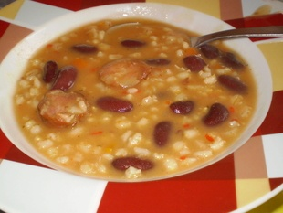

# Ricet
<figure markdown>
  { width="850" .shadow-box}
  <figcaption></figcaption>
</figure>

## Timing and Quantity
| :fork_and_knife_with_plate: Serves | :timer_clock: Total Time |
|:----------------------------------:|:-----------------------: |
| 6 portions | x minutes |

## :salt: Ingredients
- [ ] 2 luka
- [ ] 25 dag ječmene kaše
- [ ] 2 kranjske kobasice(suho meso...), špek
- [ ] 1  limenka crvenoga graha
- [ ] sol,papar,lovorov list,vegeta,crvena mljevena paprika
- [ ] 2 žlice kečapa

## :pencil: Instructions

### Step 1
Jedan luk sitno nasjeckati  popržiti ga na ulju,kad postane staklast dodati    ječmenu kašu, dva lista lovora. Zaliti vodom i kuhati oko sat ( sat i pol ) na laganoj vatri (tj.dok se kaša ne skuha).

### Step 2
Pred kraj dodati  grah iz limenke

### Step 3
3.  Drugi luk sitno nasjeckati pržiti na ulju dodati slaninu da se malo prepeće i na kraju dva češnja češnjaka sitno sjeckana.

### Step 4
Dodati u grah i ječmenu kašu i dodati začine: sol, vegetu, crvenu mljevenu papriku i kečap ( može i bez ako ti smeta ), ja dodam kajenski papar i malo ljute paprike.

## :link: Source

* grandma
