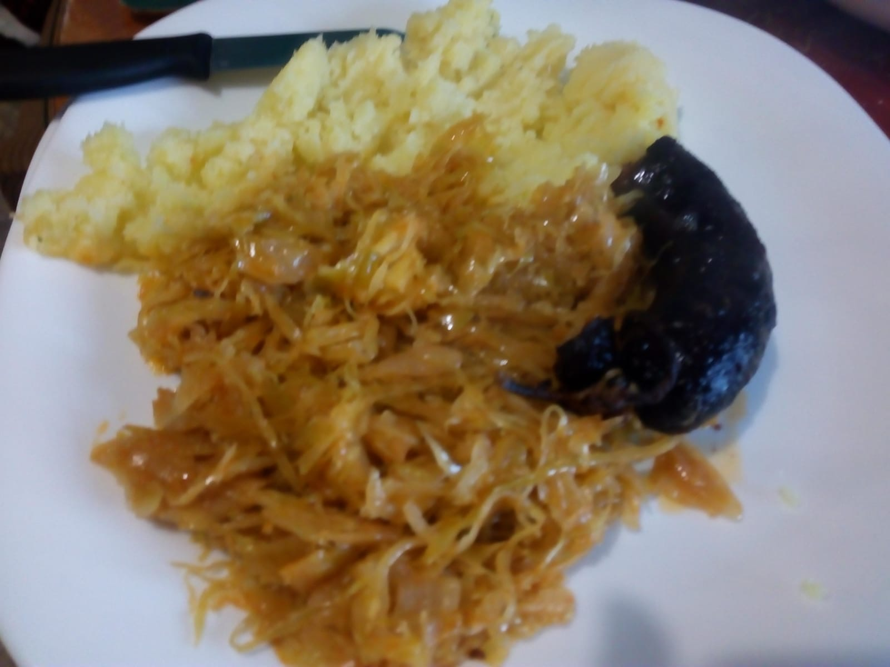

# Sausage and sauerkraut
<figure markdown>
  { width="850" .shadow-box}
  <figcaption></figcaption>
</figure>

## Timing and Quantity
| :fork_and_knife_with_plate: Serves | :timer_clock: Total Time |
|:----------------------------------:|:-----------------------: |
| 4 portions | 75 minutes |

## :salt: Ingredients
- [ ] 6 krumpira
- [ ] 1,2 kg zelja
- [ ] 1 crveni luk
- [ ] ulje, vegeta sol, crvana slatka paprika, biber, kurkuma
- [ ] krvavice ili mesne kobasice

## :pencil: Instructions

### Step 1
Cook and mash the potatos.

### Step 2
Crveni luk nasjeckati i pržiti do zlatne boje na ulju, dodati kiselo zelje i začine: vegeta, sol, crvenu papriku malu žličicu, biber i kurkumu.

### Step 3
Kobasice peći ako su krvavice, mesnate kobasice skuhati, kuhane se stave u zelje i malo dinstaju sa zeljem.

## Additional Notes
Any additional notes or tips related to the recipe

## :link: Source
* grandma
